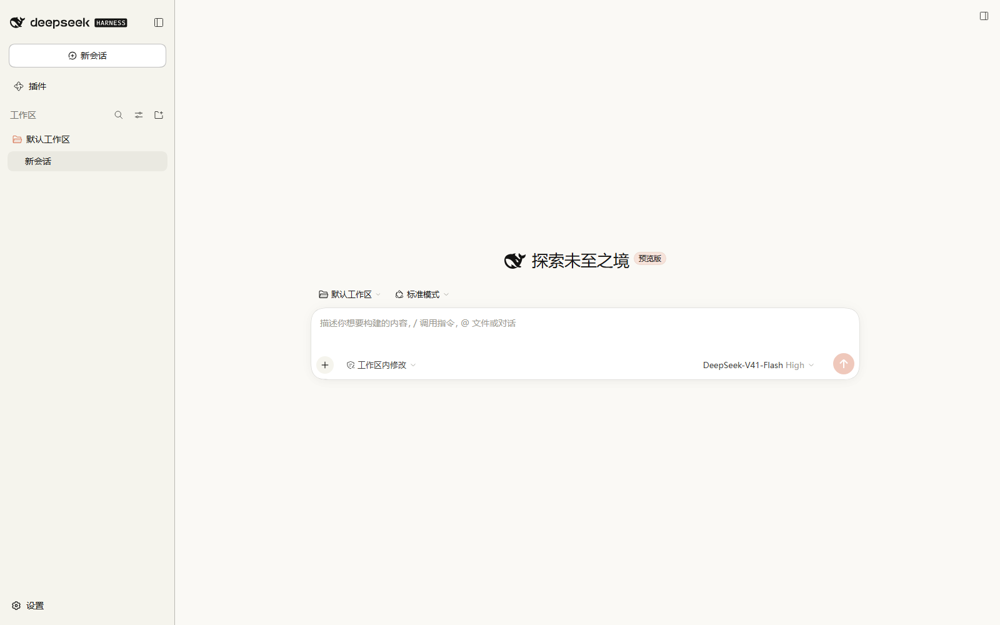
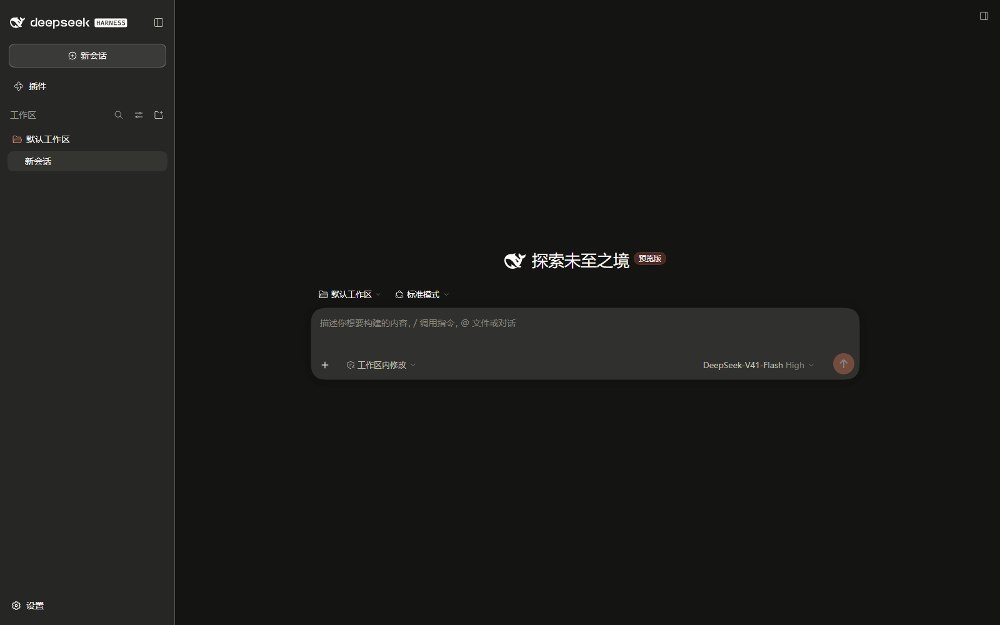
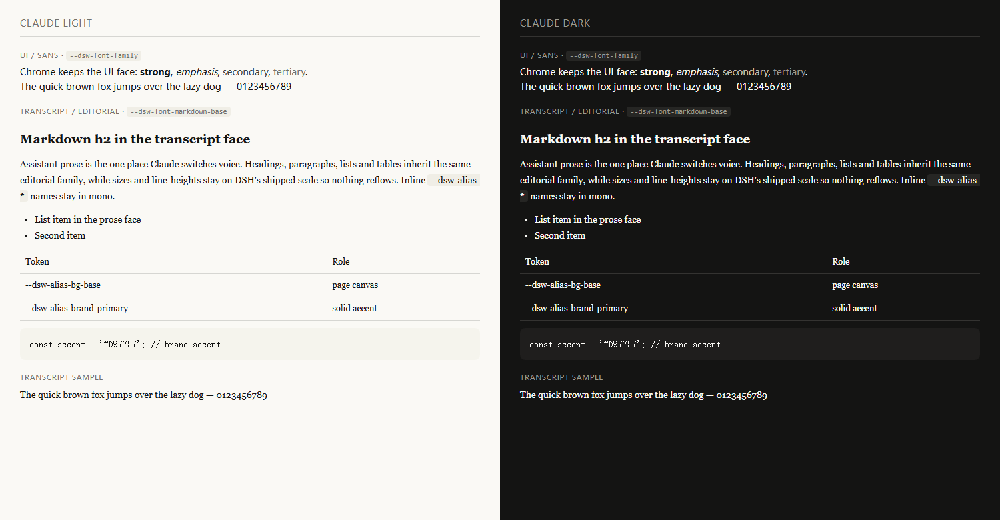

# dsh-plugin-claude-theme

A [DeepSeek Harness](https://github.com/deepseek-ai/deepseek-harness) bundle that re-skins the Harness
Web/Desktop GUI in the visual language of the Claude web app — Anthropic's warm ivory and terracotta
palette, and Claude's editorial-serif transcript set against the Anthropic Sans UI face.

It is a *theme* plugin: it stacks one token override layer over whichever built-in palette you picked, so
**Settings → Appearance → Light / Dark / System keeps working** and each choice resolves to Claude's own
light or dark values.



*Claude's light palette in the Harness GUI: warm ivory canvas, `#F5F4ED` sidebar, `#FFFFFF` composer with
a warm hairline, `#141413` text, and the terracotta accent on the primary control.*



*The dark palette: `#141413` canvas, `#262624` sidebar, `#30302E` composer. Settings → Appearance →
Light / Dark / System still selects between them.*

---

## Requirements

- DeepSeek Harness `>= 0.2.0-rc.2`, with the **Web or Desktop** GUI (the theme is a browser-side plugin;
  `headless`, `sdk` and `acp` profiles have no UI to theme).
- `dsh` on your `PATH`, or the command runtime installed by the Desktop app.
- Node is only needed for the development scripts in this repository, not to use the plugin.

## Install

```
dsh plugin --profile <profile> add dsh-plugin-claude-theme
```

That is the whole installation: the command installs the package into the profile and selects it as a
profile bundle, and the bundle's patch mounts the theme row.

A profile name is required — `desktop` for the packaged desktop app, or `web` for a browser profile
served by `dsh web`:

```
dsh plugin --profile desktop add dsh-plugin-claude-theme
dsh plugin --profile web     add dsh-plugin-claude-theme
```

<details>
<summary>Alternative installation methods</summary>

**pnpm directly.** Run it inside the profile directory, then enable the bundle, because plain pnpm does not
select bundles:

```
cd "$DSH_HOME/profiles/<profile>"      # PowerShell: cd "$env:USERPROFILE\.dsh\profiles\<profile>"
pnpm add dsh-plugin-claude-theme
```

Then open the **Plugins** page in the Harness sidebar and enable *Claude Theme*, or add
`"dsh-plugin-claude-theme"` to that profile's `package.json` under `dsh.profile.bundles`.

**From this repository,** before the package is published to npm:

```
dsh plugin --profile <profile> add github:Nyaruko306/dsh-plugin-claude-theme   # needs repository access
dsh plugin --profile <profile> add link:/absolute/path/to/dsh-plugin-claude-theme
dsh plugin --profile <profile> add file:/absolute/path/to/dsh-plugin-claude-theme
```

`link:` symlinks your checkout, so later edits are picked up; `file:` copies it. The repository is private,
so a `github:` install requires credentials.

> DSH passes the arguments after `add` straight to pnpm, so any spec pnpm accepts works — a registry name,
> a git address, a tarball, a directory.

</details>

### After installing

**Reload the GUI page.** Installing a bundle normally activates it in the running harness — measured on
the desktop app, the newly installed bundle was being served within seconds while the same processes
stayed alive. There is no need to restart.

If the theme does not appear, restart the harness, because a few changes are only applied on a cold start:

- **Replacing** an already-installed package — the harness must load a fresh JavaScript module generation.
- A hand-edited row or `config` in the profile's `cordis.patch.yml`.

To restart the desktop app, quit it fully: right-click the tray icon → **退出 DeepSeek Harness** / **Quit
DeepSeek Harness** and confirm. Closing the window only hides it to the tray, and launching the app again
just focuses the running instance, so neither restarts it. For a `dsh web` profile, stop and restart the
command.

Confirm the harness mounted the plugin without opening a browser:

```
node scripts/verify.mjs                          # or: npm run verify
node scripts/verify.mjs --url http://127.0.0.1:8080
```

`MOUNTED` means the harness published the bundle, so the row is mounted. `NOT MOUNTED` means the row is
not live yet — restart as above.

### Configure

The row takes one option. Edit the `theme-claude` row in the profile's `cordis.patch.yml`, or reinstall
with a `--patch` overlay:

```yaml
- id: theme-claude
  name: dsh-plugin-claude-theme
  config:
    serifResponses: true   # false renders the transcript in the UI sans face
```

| Option | Default | Effect |
|---|---|---|
| `serifResponses` | `true` | Assistant prose uses Claude's editorial serif face. `false` keeps the whole UI in one sans face. |

The option is resolved by the plugin's host half and published to the browser as the `--dcl-prose-font`
body variable, so switching faces needs no rebuild. Any other stylesheet may define that same variable to
override the prose face.

### Uninstall

```
dsh plugin --profile <profile> remove dsh-plugin-claude-theme
```

Restart to return to the shipped theme.

---

## What changes

### Palette

Anthropic publishes the host tokens it hands to embedded apps; those structural values are the spine of
this theme, cross-checked against community dumps of claude.ai's stylesheet.

| Role | Light | Dark |
|---|---|---|
| Page canvas | `#FAF9F5` | `#141413` |
| Sidebar | `#F5F4ED` | `#262624` |
| Raised surface (composer, cards, popovers) | `#FFFFFF` | `#30302E` |
| Primary text | `#141413` | `#FAF9F5` |
| Secondary text | `#3D3D3A` | `#C2C0B6` |
| Tertiary text | `#73726C` | `#9C9A92` |
| Hairlines (l1 → l4) | `#1F1E1D` @ 8 / 16 / 28 / 40 % | `#DEDCD1` @ 8 / 16 / 28 / 40 % |
| Accent — brand, focus, links, switches | `#D97757` | `#E0876A` |
| Accent — solid primary action | `#C6613F` | `#C6613F` |

The full table lives in [`tokens.mjs`](tokens.mjs) (202 tokens — every one of them a `--dsw-*` /
`--ds-font-*` token DSH actually declares). Most of it is a *re-tint of the ramps* rather than a
per-token rewrite: DSH derives its semantic aliases from `--dsw-static-neutral-bluish-*` and friends, so
replacing those ramps with warm ladders carries every alias this plugin does not name explicitly.

### Typography

```
sans   "Anthropic Sans", "Anthropic Sans Variable", "Styrene B", "Styrene A",
       system-ui, -apple-system, "Segoe UI", Roboto, "Helvetica Neue", Arial,
       "PingFang SC", "Hiragino Sans GB", "Microsoft YaHei", sans-serif
serif  "Anthropic Serif", "Anthropic Serif Variable", "Tiempos Text", "Tiempos",
       ui-serif, Georgia, Cambria, "Source Serif 4", "Songti SC", SimSun, serif
mono   ui-monospace, "Anthropic Mono", "SF Mono", SFMono-Regular, Menlo,
       "Roboto Mono", Consolas, "Liberation Mono", "PingFang SC", "Microsoft YaHei", monospace
```

Anthropic Sans / Serif / Mono are the current (2025–26) brand faces and are not redistributable, so they
are requested first and the stacks degrade through the previous brand faces (Styrene, Tiempos) into the
platform faces. The CJK tails mirror DSH's shipped stack so Chinese and Japanese content keeps its
metrics.

DSH expands every markdown face from one `font:` shorthand ending in `var(--dsw-font-family)`. This plugin
restates those 14 shorthands — byte-for-byte the shipped size and line-height formulas, only the family
swapped — so the transcript gets its own face without disturbing the UI font.



*Generated by `node scripts/specimen.mjs` from `tokens.mjs` — the same declarations the plugin publishes
and the same consumption the shipped sheets use. On a machine without the Anthropic faces, the UI falls to
the platform sans (Segoe UI here) and the transcript to Georgia, which is what the samples show.*

---

## How it works

```
                 host process                          browser
   ┌───────────────────────────────────┐   ┌──────────────────────────────────┐
   │ lib/index.js                      │   │ lib/client.js                    │
   │  Config { serifResponses }        │   │  inject: ['theme']               │
   │  webserver/index-inject ──────────┼──▶│  ctx.theme.overrideTokens(       │
   │    body script: --dcl-prose-font  │   │    PLUGIN_ID, TOKENS)            │
   └───────────────────────────────────┘   └──────────────────────────────────┘
                                                          │
                                       ui-layout presenter │ body.style.setProperty
                                                          ▼
                                       202 `--dsw-*` custom properties on <body>
```

The package follows the DSH bundle conventions, so one install provides both halves:

| Declared | Why |
|---|---|
| `dsh.bundle.patch` → [`cordis.patch.yml`](cordis.patch.yml) | Makes this a *bundle*. DSH selects a newly installed bundle automatically, and the patch inserts the `theme-claude` row that mounts the plugin |
| `dsh.client.platform: "web"` + `exports["./client"]` | The browser half. `@deepseek-ai/dsh-client-modules` serves it under `/plugins` and the shell registers a lazy factory whose id is the package name |
| `exports["./locale/*.json"]`, `locale/en.json`, `locale/zh.json` | Display title and description for the Plugins page |
| `icon: "./assets/icon.svg"` | Plugins-page artwork |
| `Config { serifResponses }` | Validates the row's `config` at activation |

- The **browser half** registers one `ctx.theme.overrideTokens` layer. Declaring it as a layer rather than a
  registered theme id is deliberate: `setTheme` persists only the built-in preferences, so a third-party
  theme id would be lost on reload, while a layer is re-established by the plugin on every boot and still
  composes with light/dark/system.
- `inject: ['theme']` parks the plugin until `@deepseek-ai/dsh-client-ui-theme` is live and unloads it if the
  provider goes away, so no token is ever written without an owner.
- No `@deepseek-ai/dsh*` peer is declared. DSH's compatibility gate evaluates exactly those peers and skips a
  bundle whose range misses the runtime, so `engines.dsh` documents compatibility without that risk.
- `scripts/build.mjs` inlines `tokens.mjs` into `lib/client.js` and parses the result before writing, so the
  host half and the browser half cannot drift and a broken bundle cannot reach the module system.

### Development

```
npm install                                  # one devDependency, for the checker

npm run build                                # regenerate lib/client.js from tokens.mjs
npm run check                                # manifest/bundle/metadata consistency gate
npm run specimen                             # refresh docs/specimen.html
node scripts/check.mjs --sheets <dir>        # also verify every token name against DSH's sheets
npm run capture -- --url <url> --out <png>   # screenshot a running GUI (see below)
```

**Capture figures from an isolated home.** The screenshots in `docs/` are of a real GUI, and a screenshot
of a *personal* harness home leaks whatever the sidebar, session title and account row hold — workspace
directory names, a masked phone number, the local user name. That is pixel data, so no text scan catches
it. `scripts/capture-figures.mjs` documents the throwaway-`DSH_HOME` recipe in its header and steps
through first-run dialogs choosing "configure later", so nothing is configured and nothing personal is in
frame. Look at any figure before publishing it.

`lib/client.js` is **committed on purpose**: DSH serves the built bundle, and pnpm blocks install-time
build scripts, so a consumer never builds it. CI fails if the committed bundle is stale.

To preview a palette without touching your desktop profile, link this checkout into a scratch profile and
boot it with a config overlay:

```
dsh plugin --profile web add link:/absolute/path/to/dsh-plugin-claude-theme
dsh --profile web --patch dev/light.patch.yml --no-open --port 8099
dsh --profile web --patch dev/dark.patch.yml  --no-open --port 8099
dsh --profile web --patch dev/sans.patch.yml  --no-open --port 8099
```

The overlays only override row *config* (the palette preference, and `serifResponses` for the sans
variant); the theme row itself comes from the bundle patch, so they never insert a second row with the
same id.

Once the row is mounted, palette iteration against a **running** app needs no restart: run
`npm run build` and reload the GUI page. DSH's client reload chain republishes the bundle under a new
metadata revision within seconds (measured: same process IDs, new revision served `HTTP 200`). Installing
the bundle also activates live; only *replacing* the package or hand-editing a row in the profile patch
needs a cold start.

---

## Verification

Each claim above was checked against a running harness, not inferred from the code. The install path was
exercised the way a user would run it.

| Check | Method | Result |
|---|---|---|
| **The theme renders in the Harness GUI** | captures from an isolated `DSH_HOME` holding no workspace, session or account data | [light](docs/gui-light.png) / [dark](docs/gui-dark.png) |
| **The packaged desktop app runs the theme** | live Electron window capture after restarting it, plus a probe of the plugin's bundle route on the running app | verified: ivory canvas, `#F5F4ED` sidebar, white composer, terracotta primary control. The captures published here come from an isolated profile |
| **Assistant prose takes the editorial serif** | specimen generated from `tokens.mjs`, plus a live read of the applied `--dsw-font-markdown-*` tokens | serif prose against sans UI chrome — see [typography](docs/typography.png) |
| **The accent is Claude's, not DSH's** | live read of `--dsw-alias-button-primary-fill` and the rendered control | `#C6613F`, not the shipped near-black |
| The bundle installs and mounts through the documented command | `dsh plugin --profile web add link:<path>` on a scratch profile | bundle auto-selected into `dsh.profile.bundles`; row mounted; `scripts/verify.mjs` → `MOUNTED` |
| Installing activates in a running harness | installed the bundle into the live desktop profile; probed both plugin names and re-checked process start times | new bundle `HTTP 200`, old bundle `HTTP 404`, same PIDs — no restart |
| Uninstall restores the profile | `dsh plugin --profile web remove dsh-plugin-claude-theme` | dependency and bundle selection both gone |
| The desktop bundle stack accepts the row | profile cloning the `desktop` manifest (`dsh-base`, `dsh-web-app`, `dsh-experimental-auto-review`) plus its patch layer | `--dump-config` exit 0, row present, **no warnings**; a real boot printed **no "entry did not activate"** |
| The bundle is published by the harness | public `/plugins/…` route at the file's metadata revision | HTTP 200 against the running desktop app |
| Bundle edits reload without a restart | rewrote `lib/client.js`, polled the new revision, re-checked process start times | new revision served `HTTP 200` while the same PIDs stayed alive |
| Tokens reach the document | the `style` attribute read back from the live `<body>` | every plugin token applied, including `--dsw-font-family`, `--ds-font-family-code` and the serif-bearing `--dsw-font-markdown-*` |
| The `serifResponses` option is honoured | served index with `serifResponses: false` | injected body script pins `--dcl-prose-font` to the sans stack |
| Every token name is real | `scripts/check.mjs --sheets <dir>` against the shipped sheets | all 202 names are tokens DSH declares |

## Known limitations

- **The brand faces are not bundled.** Without Anthropic Sans/Serif installed, the UI falls to the platform
  sans and the transcript to Georgia/Cambria. That is intentional (the faces are proprietary), but it means
  the result is *Claude's palette and typographic structure*, not its exact letterforms.
- **The accent is contested.** Anthropic's brand guidance says `#D97757`; claude.ai's live primary button is
  reported as `#C6613F`; the 2024 stylesheet used `#C96442`. This plugin uses `#D97757` for accents and
  `#C6613F` for solid primary fills.
- **Hover and pressed surfaces are inferred.** Anthropic publishes no hover tokens; the warm washes here are
  derived from the surface families.
- **The sidebar mapping is inferred.** "Sidebar" is not a documented Claude token; the dark pair (`#262624`
  sidebar / `#30302E` raised) is the reading that matches community descriptions.
- **Row options are read at mount.** `serifResponses` is a plain (non-volatile) config value, so changing it
  needs a restart.
- **The theme is global.** It re-tints the whole Harness Web UI, not one panel; there is no per-surface
  opt-out.

## Attribution and sources

**Not affiliated with, endorsed by, or sponsored by Anthropic.** Claude is a trademark of Anthropic PBC.
This package reproduces publicly documented design token *values* only; it redistributes no Anthropic
assets, fonts or logotypes.

- [Anthropic — MCP Apps design guidelines](https://claude.com/docs/connectors/building/mcp-apps/design-guidelines)
  (host token tables: backgrounds, text, borders, type scale, radii)
- [Anthropic — Blend your MCP App with Claude's theme](https://claude.com/docs/connectors/building/mcp-apps/transparent-theming)
  (`--font-*`, `assets.claude.ai`)
- [anthropics/skills — brand-guidelines](https://github.com/anthropics/skills/blob/main/skills/brand-guidelines/SKILL.md)
  (`#d97757`, `#faf9f5`, `#141413`, `#b0aea5`, `#e8e6dc`)
- [Anthropic brand — typography](https://brand.anthropic.com/typography) (Anthropic Sans Variable, 2025–26)
- [ColorArchive — Anthropic](https://colorarchive.org/brands/anthropic/) (claude.ai `#C6613F`, 2024 `#C96442`)

Beware popular "Claude theme" repositories that ship unmodified shadcn/ui defaults — several of them are
not Claude's palette at all.

## License

MIT — see [LICENSE](LICENSE).
